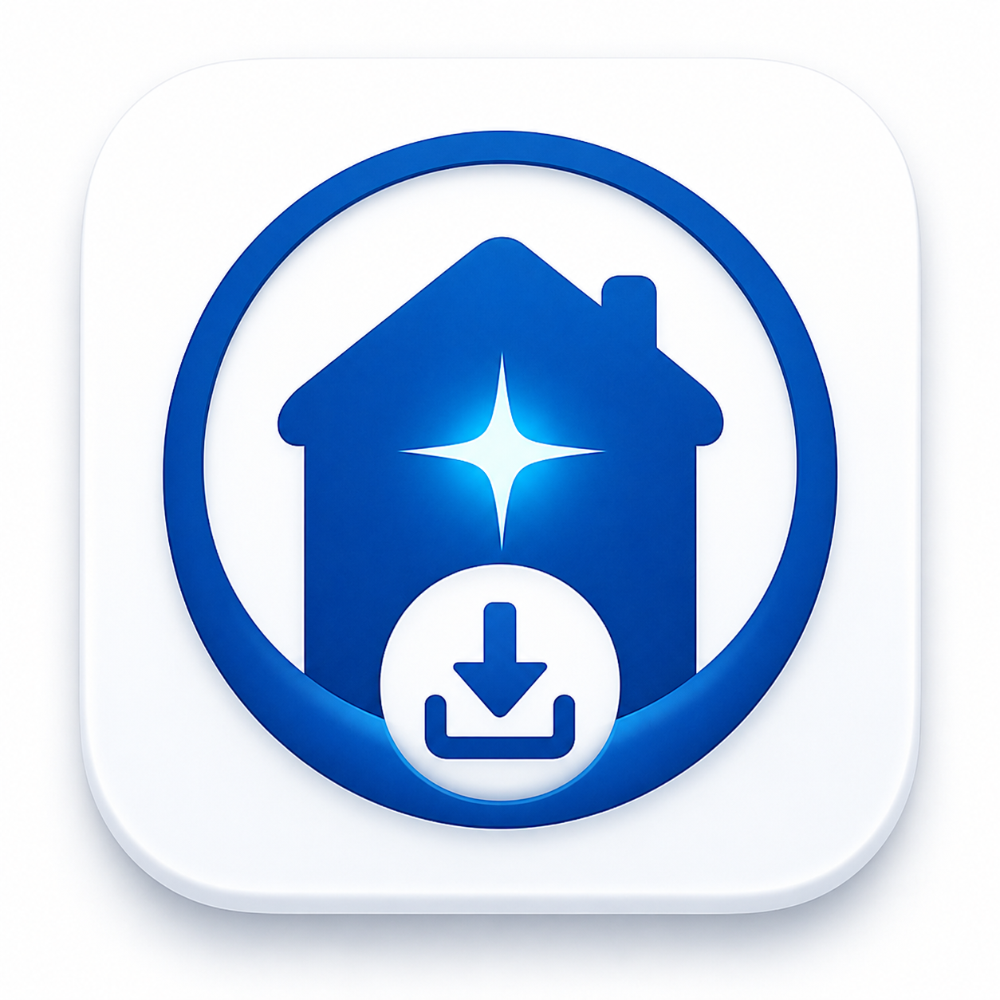

# SafeAI Model Finder

<p align="center">
  <a href="https://ai-insider.site/"></a>
</p>

<p align="center"><a href="https://ai-insider.site/">ai-insider.site</a></p>

Uno strumento gratuito, privato e completamente locale per il desktop che
consiglia i migliori modelli Ollama per il tuo computer, li scarica in modo
sicuro tramite la tua installazione locale di Ollama e li verifica sul
posto, senza inviare nessun tuo dato al cloud.

SafeAI Model Finder gira come singolo binario Rust sulla tua macchina.
Rileva il tuo hardware, apre una scheda del browser locale come interfaccia
e usa la tua installazione locale di Ollama per gestire i modelli. Nessuna
informazione sul tuo computer esce dalla macchina.

## Funzionalità

- **Consigli basati sull'hardware.** Analizza CPU, RAM, GPU, VRAM e sistema
  operativo, poi suggerisce i modelli Ollama che girano davvero su questa
  macchina.
- **Modalità Semplice e Modalità Avanzata.** La Modalità Semplice mostra un
  modello consigliato, un'alternativa più veloce e leggera e
  un'alternativa di qualità superiore. La Modalità Avanzata espone
  l'intero catalogo dei modelli con filtri, ricerca e scelta della
  quantizzazione.
- **Viste Trova / Sfoglia / Installati.** Scopri nuovi modelli o lavora
  con quelli già presenti nel tuo store Ollama locale.
- **Benchmark di prestazioni.** Misura i token al secondo reali sul tuo
  hardware prima di scegliere un modello.
- **Pianifica hardware.** Proietta come si comporterà un modello su
  fasce di memoria diverse.
- **Interfaccia in italiano e inglese.** UI internazionalizzata.
- **Politica di rete rigorosamente locale.** Il server HTTP locale si
  collega solo a `127.0.0.1`, rifiuta header `Host` inaspettati, richiede
  un token di sessione generato a ogni avvio su tutti gli endpoint che
  modificano lo stato, e non ricade mai su un bind pubblico.

## Avvio rapido

Per partire servono solo due cose: **Ollama** (già installato e in
esecuzione) e **SafeAI Model Finder** stesso.

1. **Assicurati che Ollama sia installato e in esecuzione.**
   Scaricalo da <https://ollama.com/download> per la tua piattaforma.
   SafeAI Model Finder gestisce i modelli tramite la tua installazione
   locale di Ollama — se Ollama manca o è fermo, lo strumento mostrerà
   "Ollama not running" e gli scaricamenti falliranno con
   `Connection refused`. SafeAI Model Finder non include né sostituisce
   Ollama; i modelli che hai già oggi restano dove sono.

2. **Installa SafeAI Model Finder dal terminale** (una sola riga):

   ```bash
   cargo install --git https://github.com/fabiofurlano/SafeAI-Model-Finder --locked
   ```

3. **Avvialo**:

   ```bash
   safeai-model-finder
   ```

   Si apre una scheda del browser a `http://127.0.0.1:8787/` (o su
   un'altra porta libera di loopback se 8787 è occupata), l'interfaccia
   rileva il tuo hardware, mostra i modelli già presenti nel tuo Ollama
   e ti permette di trovare, sfogliare e scaricarne di nuovi.

Se il setup da terminale non fa per te, passa a
[Installazione con un agente AI](#installazione-con-un-agente-ai):
trovi un prompt di installazione pronto da copiare per ChatGPT Codex,
Claude Code, Cline, Cursor agent, OpenCode o qualsiasi altro agente
di coding/computer con accesso al terminale.

Se qualcosa non funziona, vedi
[Risoluzione problemi](#risoluzione-problemi).

## Requisiti

SafeAI Model Finder si installa e si avvia da terminale. Ti serve:

**Per installare lo strumento (una tantum)**

- La toolchain **Rust**, installata tramite **rustup** da
  <https://rustup.rs>. `rustup` installa insieme `rustc`, `cargo` e
  `rustup` — Cargo **non** è un prerequisito separato. Dopo che
  rustup ha finito, apri un **nuovo terminale** oppure esegui
  `source "$HOME/.cargo/env"` così `cargo --version` funziona nella
  shell corrente. (Questo è il passaggio che salta più spesso su una
  macchina nuova.)
- **Rust 1.95 o più recente** (`rustc --version`).
- Una toolchain C standard — Rust ha bisogno di un linker per compilare
  le dipendenze native:
  - **Linux:** la maggior parte delle distribuzioni include `gcc` /
    `cc` di serie.
  - **macOS:** installa gli Xcode Command Line Tools
    (`xcode-select --install`).
  - **Windows:** installa Visual Studio Build Tools con il carico di
    lavoro "Sviluppo desktop con C++".
- Accesso alla rete durante l'installazione, così Cargo può scaricare
  le dipendenze Rust pubblicate. Nessun codice sorgente o dato di
  sistema viene inviato fuori.

**Per avviare SafeAI Model Finder**

- Il binario installato: `safeai-model-finder` (finisce in
  `~/.cargo/bin` dopo il passo di installazione qui sotto).
- Un browser web sulla stessa macchina (Chrome, Firefox, Edge, Safari:
  qualsiasi browser moderno). Il browser è solo l'interfaccia; nessun
  dato lascia la connessione di loopback.

**Per gestire ed eseguire i modelli locali**

- Un'istanza di **Ollama** installata e in esecuzione sulla stessa
  macchina. Scaricala da <https://ollama.com/download>. L'accesso alla
  rete è necessario quando *tu* inizi uno scaricamento di un modello
  tramite Ollama; SafeAI Model Finder di per sé non avvia nessuno
  scaricamento senza la tua conferma esplicita.

## Installazione da sorgente

Questo è il percorso che la maggior parte degli utenti seguirà —
installare SafeAI Model Finder in `~/.cargo/bin` direttamente dal
repository GitHub pubblico.

```bash
cargo install --git https://github.com/fabiofurlano/SafeAI-Model-Finder --locked
```

Il flag `--locked` blocca ogni dipendenza alle versioni esatte registrate
nel `Cargo.lock` presente nel repo, per un'installazione riproducibile e
deterministica. L'installazione mette un singolo binario di nome
`safeai-model-finder` in `~/.cargo/bin`.

**In una shell in cui rustup è appena stato installato**, esegui prima:

```bash
source "$HOME/.cargo/env"
```

oppure apri una nuova finestra del terminale, poi rilancia il comando
`cargo install`.

Per disinstallare:

```bash
cargo uninstall safeai-model-finder
```

---

## Installazione con un agente AI

Se installare uno strumento da terminale da zero non è il tuo forte,
puoi affidare l'installazione a un agente di coding/computer capace
con accesso al terminale (ChatGPT Codex, Claude Code, Cline, Cursor
agent, OpenCode o simili) copiando uno dei prompt qui sotto e
incollandolo nell'agente. I prompt dicono esattamente all'agente cosa
controllare, cosa installare, cosa **non** toccare (i tuoi modelli
Ollama esistenti, la tua installazione Ollama esistente, le tue
toolchain esistenti) e come verificare che tutto funzioni alla fine.

Scegli il prompt per il tuo sistema operativo:

- [Linux](docs/agent-install/INSTALL-LINUX.md) — provato end-to-end
  su un'installazione Linux nuova (VM Vast.ai con KDE, RTX 3060).
- [macOS](docs/agent-install/INSTALL-MACOS.md)
- [Windows](docs/agent-install/INSTALL-WINDOWS.md)

Se qualcosa si comporta male e preferisci non mettere mano al terminale,
copia invece il prompt di risoluzione problemi:

- [Risoluzione problemi](docs/agent-install/TROUBLESHOOT.md)

L'agente deve sempre chiederti conferma prima di cancellare modelli,
reinstallare Ollama o sostituire una toolchain esistente.

---

## Aggiornamento

Non è necessario disinstallare SafeAI Model Finder prima di
aggiornarlo. La stessa invocazione `cargo install --git … --locked
--force` che installa il binario la prima volta sostituisce anche
il comando già installato con l'ultima versione pubblicata nel
repository GitHub pubblico:

```bash
cargo install --git https://github.com/fabiofurlano/SafeAI-Model-Finder --locked --force
```

- `--git …` recupera l'ultimo commit pubblico di `main`.
- `--locked` blocca ogni dipendenza alle versioni esatte registrate
  nel `Cargo.lock` presente nel repo, per una build riproducibile e
  deterministica.
- `--force` sovrascrive il binario `~/.cargo/bin/safeai-model-finder`
  già presente senza che tu debba prima eseguire `cargo uninstall`.

Le tue impostazioni, i modelli esistenti, i modelli già scaricati e
l'ambiente Ollama locale non vengono toccati. Viene sostituito solo
il binario. Una volta terminato il comando, ti basta rilanciare
`safeai-model-finder`.

## Avvio

```bash
safeai-model-finder
```

Lo strumento stampa un token di sessione generato per questo avvio,
apre il tuo browser predefinito all'URL locale che serve
(`http://127.0.0.1:<porta>/?token=…`), stampa l'hardware rilevato ed
elenca gli eventuali modelli già installati. Premi Ctrl+C per fermarlo.

Se un altro programma locale sta già usando la porta locale predefinita,
SafeAI Model Finder ne sceglie automaticamente un'altra libera su
loopback e stampa un messaggio chiaro, ad esempio:

```
Port 8787 is already in use; using local port 34419 instead.
```

Non devi fare nulla: lo strumento apre il browser al nuovo URL. Tutto
il traffico resta su `127.0.0.1`; nulla è esposto alla rete.

## Privacy

- Il server HTTP locale si collega solo a `127.0.0.1`. È raggiungibile
  dal browser sulla stessa macchina e basta.
- Il server rifiuta gli header `Host` inaspettati e richiede il token di
  sessione (consegnato al browser nell'URL all'avvio) su ogni endpoint
  che modifica lo stato.
- SafeAI Model Finder **non** invia le informazioni sul tuo hardware,
  i benchmark o le scelte di modello a nessuna terza parte.
- Non registra account, non chiama casa, non ha telemetria.
- L'attività di rete è limitata a:
  1. Cargo che recupera le dipendenze Rust del progetto al momento
     dell'installazione.
  2. Il servizio Ollama locale su loopback durante il funzionamento
     normale.
  3. Lo scaricamento del modello Ollama che confermi esplicitamente
     nell'interfaccia.

## Compatibilità con SafeAI Desktop e SafeAI Office

SafeAI Model Finder, **SafeAI Desktop** e **SafeAI Office** possono
condividere lo stesso ambiente Ollama locale. Quando le tre
applicazioni sono configurate per usare la stessa istanza di Ollama
sulla stessa macchina, ogni modello che SafeAI Model Finder scarica
per te finisce nella normale directory dei modelli di Ollama ed è
quindi visibile e utilizzabile anche da SafeAI Desktop e SafeAI
Office, senza alcun passaggio, importazione o sincronizzazione
extra.

- SafeAI Model Finder **scrive solo** nella directory locale dei
  modelli di Ollama. **Non** legge, scrive o modifica SafeAI Desktop,
  SafeAI Office, né alcuno dei loro file, impostazioni o
  configurazione.
- Nessuna sincronizzazione in background. Nessun relay cloud.
  Nessuna procedura guidata di import. La "condivisione" è il semplice
  fatto che tutte e tre puntano alla stessa istanza locale di Ollama.
- Se usi solo SafeAI Model Finder e non avvii mai SafeAI Desktop o
  SafeAI Office, per te non cambia nulla. La compatibilità è puramente
  additiva: lo stesso modello scaricato è utilizzabile da quelle app
  quando le usi, senza alcuna azione aggiuntiva da parte di SafeAI
  Model Finder.
- Rimuovere un modello da SafeAI Model Finder lo rimuove dalla
  directory dei modelli di Ollama, quindi scompare anche da SafeAI
  Desktop e SafeAI Office. È il normale comportamento di Ollama — non
  un'azione di SafeAI Model Finder verso quelle applicazioni.

## Risoluzione problemi

Se qualcosa non funziona, scorri questo breve elenco nell'ordine
indicato. Ogni voce spiega cosa controllare, cosa di solito risolve
e dove trovare aiuto.

**`cargo: command not found` dopo aver installato rustup.**
È l'errore più comune su una macchina nuova. `rustup` mette Cargo in
`~/.cargo/bin`, ma la shell corrente potrebbe non avere ancora quella
directory in `PATH`. Apri un nuovo terminale, oppure nella shell
corrente esegui:
```bash
source "$HOME/.cargo/env"
cargo --version
```

**SafeAI Model Finder mostra "Ollama not running".**
Installa Ollama da <https://ollama.com/download> se non c'è, oppure
avvia il servizio se è installato ma fermo. Una volta che `ollama serve`
risponde sul loopback, Model Finder lo rileverà al prossimo riavvio.

**Il modello è elencato in Ollama ma Model Finder mostra un timeout
del test di prontezza.**
Verifica prima che il modello sia effettivamente utilizzabile:
```bash
ollama list
ollama run <nome-modello> "ciao"
```
Se entrambi vanno a buon fine, il modello è sano e il timeout era un
mancato rilevamento di Model Finder — non serve riscaricarlo. Non
riscaricare a meno che il modello non sia davvero assente da
`ollama list`.

**Il browser mostra `Connection refused` all'avvio di Model Finder.**
Assicurati che Ollama sia in esecuzione e raggiungibile su
`127.0.0.1:11434`. L'errore `Connection refused` in Model Finder di
solito significa che Ollama non c'è ancora.

**La GPU non viene rilevata su Linux.**
Controlla che l'installer ufficiale di Ollama (che configura il
runtime GPU in bundle) sia andato a buon fine. Se hai installato Ollama
da un pacchetto della distribuzione, il supporto GPU potrebbe
mancare.

**`cargo install` fallisce a metà.**
Rilancia lo stesso comando. `cargo install` è riprendibile: solo le
crate non ancora compilate verranno compilate la volta successiva.

Se preferisci non mettere mano al terminale, copia il
[prompt di risoluzione problemi](docs/agent-install/TROUBLESHOOT.md) in
un agente di coding/computer e lascialo guidare la diagnosi.

## Riconoscimenti

SafeAI Model Finder è costruito sopra
[llmfit](https://github.com/AlexsJones/llmfit) di Alex Jones e dei
contributori, fissato al tag upstream v1.1.8. La licenza MIT upstream è
preservata nella root di questo repository come `LICENSE`.

Ringraziamo il progetto llmfit per il rilevamento dell'hardware, il core
di model fitting e i dati di benchmark che alimentano questo prodotto.
SafeAI Model Finder è un fork indipendente dall'upstream; gli autori
upstream non hanno revisionato né endorsato questo fork.

## Licenza

Questo prodotto è rilasciato sotto la licenza MIT: vedi `LICENSE` nella
root di questo repository. La licenza è ereditata dal progetto upstream
llmfit.
